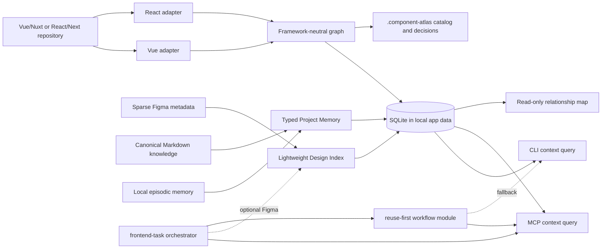

# Architecture

Project Atlas is a local-first context platform with three indexes and one
shared access layer. `Component Atlas` remains the repository/package name and
the Code Atlas implementation; existing installations migrate additively.



## Package boundaries

- `core`: graph schema, search, compact reuse context, explainable similarity,
  and impact traversal.
- `adapter-vue`: Vue SFC macros, templates, Nuxt runtime names, autoimports,
  and mirrored tests.
- `adapter-react`: exported and file-local React components, props, JSX
  composition, styling tokens, and tests.
- `design`: provider-neutral Figma metadata normalization, cached node maps,
  task ranking, variable summaries, and explainable findings.
- `memory`: typed Project Memory, Markdown frontmatter, ranking, hard response
  budgets, pagination, and secret-like content rejection.
- `store`: SQLite persistence using Node's built-in `node:sqlite`.
- `runtime`: framework detection, indexing orchestration, task-context
  composition, decision gates, proposal/application policy, and provider-neutral
  view models for the final GUI.
- `cli`: human and script interface.
- `mcp`: Codex/Claude tools over stdio.
- `viewer`: optional local Nuxt relationship map. It only reads the graph.

## Agent context contract

`buildReuseContext` is the stable integration boundary. Given a repository graph,
an implementation intent, and a candidate limit, it returns plain JSON with:

- project freshness and scope counts;
- ranked component candidates;
- source path, ownership, and public API;
- direct composition and consumers;
- explainable structural similarity;
- direct and transitive change impact;
- tests and concise next actions.

Large implementation details such as class-token arrays and full source are
excluded. Agents can call focused tools only when the compact bundle leaves a
decision unresolved. Focused component, search, similarity, usage, and impact
queries follow the same compact-by-default rule. Full indexed nodes are
available only through an explicit CLI `--raw` or MCP `raw: true` diagnostic
option.

MCP returns compact `structuredContent` and only a short human message. It does
not duplicate a full JSON result into the text channel.

## Design context contract

The Design Index is optional. It stores sparse node identity, hierarchy,
dimensions, dev status, annotations, component/variant summaries, resource
links, optional Code Connect evidence, and a cheap global variable catalog. It
never stores screenshots or generated implementation code.

`find_design_candidates` combines task terms, hierarchy, optional Ready for dev
descriptions/status, annotations, contained components, optional Code Connect,
and the nearest Atlas component names. Ready for dev is a boost, never a
filter. It returns a few ranked candidates with reasons and confidence.
`inspect_design_node` accepts a confirmed node and returns the handoff for deep
Figma tools; Atlas does not call or proxy them.

Findings use three levels:

- `decision-required`: stop before deep retrieval and ask one evidence-backed
  question because the target or a source conflict is unresolved.
- `warning`: continue, but report likely duplication, inconsistent variants,
  missing states, suspicious API fit, or Figma/code mismatch with a
  recommendation.
- `resolved`: apply a low-impact fallback and retain the reason in the result.

## Graph model

A component node records source/runtime names, scope, props, emits, slots,
models, rendered components, imports, tests, source location, class tokens, and
a content hash.

Edge types:

- `renders`: composition and reverse impact traversal;
- `similar_to`: weighted structural evidence;
- `tested_by`: component-to-test traceability.

Similarity is deterministic: name 30%, props 25%, rendered children 20%, style
tokens 15%, and API shape 10%.

## Storage

Storage follows a strict source split:

- reconstructed facts from code and Figma live in SQLite and can be regenerated;
- declared, shareable knowledge lives in project Markdown;
- local/personal knowledge and episodic outcomes live in ignored Markdown;
- every hypothesis is marked `inferred` and never presented as verified fact.

Machine state:

```text
%LOCALAPPDATA%\ComponentAtlas\projects\<project-id>\atlas.sqlite
```

The same database contains one `design_indexes` payload per Figma file key plus
project-scoped memory items, relations, proposals, and an FTS5 search index.
Version, `lastModified`, scope, and metadata hashes prevent unchanged page
snapshots from being reprocessed. A changed file version invalidates the old
map before new page snapshots are merged.

Repository and local artifacts:

```text
.component-atlas/
├── project.json
├── catalog.md
├── memory/                 # local/episodic, globally ignored
└── decisions/

project-memory/             # optional canonical team knowledge
└── *.md                    # frontmatter + Markdown + wikilinks
```

Older local databases or directories may still contain saved preview scenarios.
Atlas no longer reads, writes, or exposes them; they are left untouched so the
product change does not silently delete user material.

See [project-memory.md](project-memory.md) for the memory schema and
[token-budgets.md](token-budgets.md) for response guarantees.

## Human control plane

The complete Project Atlas GUI is the final product phase. The core already
exports provider-neutral view-model contracts so a future local API can serve
the same data used by CLI and MCP without copying persistence or business
logic. Navigating that GUI will never invoke an LLM; only an explicit
reviewed export creates a hard-capped agent package.

The current viewer is only an optional read-only Code Atlas relationship map.
It is not the final GUI and does not render components. See
[gui-roadmap.md](gui-roadmap.md) for scope and implementation gates.

## Migration from Component Atlas

Project Atlas is additive. Existing component graphs, component decision
records, Design Index rows, and the read-only map keep their contracts. Opening
an older per-project database creates the memory/FTS/proposal tables with
`CREATE TABLE IF NOT EXISTS`; it does not delete preview-era rows or user files.

New flows should prefer `get_task_context`, but `get_reuse_context` and focused
Code Atlas tools remain compatible. Existing component decisions stay
queryable through their original tools; future durable cross-project knowledge
is written through Project Memory proposals. Re-running `memory index`
reconstructs only Markdown-origin memory and preserves confirmed/outcome items.

## Scope semantics

- `public`: shared, reusable UI.
- `feature`: exported component owned by one feature.
- `private`: file-local or explicitly internal implementation detail.

A private component remains discoverable but is not a valid cross-feature
import. Choose `extract-and-reuse` when its responsibility should become shared.
