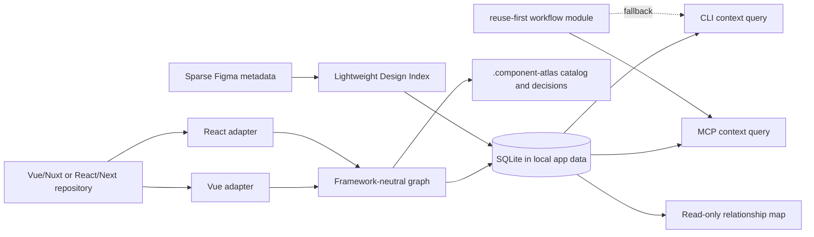

# Architecture

Component Atlas is local-first and split into analysis, storage, agent access,
and an optional read-only map.



## Package boundaries

- `core`: graph schema, search, compact reuse context, explainable similarity,
  and impact traversal.
- `adapter-vue`: Vue SFC macros, templates, Nuxt runtime names, autoimports,
  and mirrored tests.
- `adapter-react`: exported and file-local React components, props, JSX
  composition, styling tokens, and tests.
- `design`: provider-neutral Figma metadata normalization, cached node maps,
  task ranking, variable summaries, and explainable findings.
- `store`: SQLite persistence using Node's built-in `node:sqlite`.
- `runtime`: framework detection, indexing orchestration, artifacts, and
  decision records.
- `cli`: human and script interface.
- `mcp`: Codex/Claude tools over stdio.
- `viewer`: optional local Nuxt relationship map. It only reads the graph.

## Agent context contract

`buildReuseContext` is the stable integration boundary. Given a repository graph,
an implementation intent, and a candidate limit, it returns plain JSON with:

- project freshness and scope counts;
- ranked component candidates;
- source path, ownership, and public API;
- direct composition and consumers;
- explainable structural similarity;
- direct and transitive change impact;
- tests and concise next actions.

Large implementation details such as class-token arrays and full source are
excluded. Agents can call focused tools only when the compact bundle leaves a
decision unresolved. Focused component, search, similarity, usage, and impact
queries follow the same compact-by-default rule. Full indexed nodes are
available only through an explicit CLI `--raw` or MCP `raw: true` diagnostic
option.

MCP returns every result twice in one protocol response: formatted JSON text
for broad client compatibility and native `structuredContent` for clients that
can consume the result without reparsing text.

## Design context contract

The Design Index is optional. It stores sparse node identity, hierarchy,
dimensions, dev status, annotations, component/variant summaries, resource
links, optional Code Connect evidence, and a cheap global variable catalog. It
never stores screenshots or generated implementation code.

`find_design_candidates` combines task terms, hierarchy, Ready for dev
descriptions, annotations, contained components, optional Code Connect, and
the nearest Atlas component names. It returns a few ranked candidates with
reasons and confidence. `inspect_design_node` accepts a confirmed node and
returns the handoff for deep Figma tools; Atlas does not call or proxy them.

Findings use three levels:

- `decision-required`: stop before deep retrieval and ask one evidence-backed
  question because the target or a source conflict is unresolved.
- `warning`: continue, but report likely duplication, inconsistent variants,
  missing states, suspicious API fit, or Figma/code mismatch with a
  recommendation.
- `resolved`: apply a low-impact fallback and retain the reason in the result.

## Graph model

A component node records source/runtime names, scope, props, emits, slots,
models, rendered components, imports, tests, source location, class tokens, and
a content hash.

Edge types:

- `renders`: composition and reverse impact traversal;
- `similar_to`: weighted structural evidence;
- `tested_by`: component-to-test traceability.

Similarity is deterministic: name 30%, props 25%, rendered children 20%, style
tokens 15%, and API shape 10%.

## Storage

Machine state:

```text
%LOCALAPPDATA%\ComponentAtlas\projects\<project-id>\atlas.sqlite
```

The same database contains one `design_indexes` payload per Figma file key.
Version, `lastModified`, scope, and metadata hashes prevent unchanged page
snapshots from being reprocessed. A changed file version invalidates the old
map before new page snapshots are merged.

Local repository artifacts:

```text
.component-atlas/
├── project.json
├── catalog.md
└── decisions/
```

Older local databases or directories may still contain saved preview scenarios.
Atlas no longer reads, writes, or exposes them; they are left untouched so the
product change does not silently delete user material.

## Scope semantics

- `public`: shared, reusable UI.
- `feature`: exported component owned by one feature.
- `private`: file-local or explicitly internal implementation detail.

A private component remains discoverable but is not a valid cross-feature
import. Choose `extract-and-reuse` when its responsibility should become shared.
