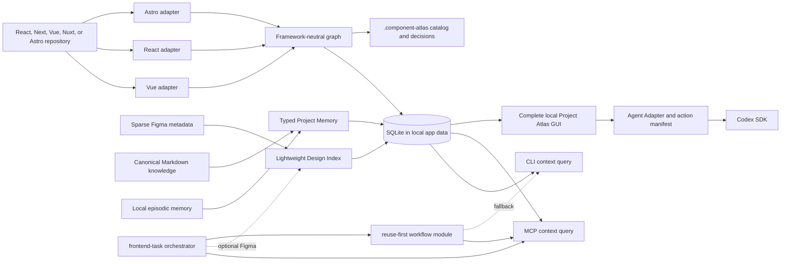

# Architecture

Project Atlas is a local-first context platform with three indexes and one
shared access layer. Existing internal package identifiers and databases remain
compatible while the product surface is Project Atlas.



## Package boundaries

- `core`: graph schema, search, compact reuse context, explainable similarity,
  impact traversal, and provider-neutral Action Center contracts.
- `adapter-vue`: Vue SFC macros, templates, Nuxt runtime names, autoimports,
  and mirrored tests.
- `adapter-react`: exported and file-local React components, props, JSX
  composition, styling tokens, and tests.
- `adapter-astro`: Astro components, routes, layouts, props, slots, and
  client/server island boundaries.
- `design`: provider-neutral Figma metadata normalization, cached node maps,
  task ranking, variable summaries, and explainable findings.
- `memory`: typed Project Memory, Markdown frontmatter, ranking, hard response
  budgets, pagination, and secret-like content rejection.
- `store`: SQLite persistence using Node's built-in `node:sqlite`.
- `runtime`: framework detection, indexing orchestration, task-context
  composition, decision gates, proposal/application policy, and provider-neutral
  GUI view models.
- `cli`: human and script interface.
- `mcp`: Codex/Claude tools over stdio.
- `viewer`: complete local Nuxt control plane over the same runtime and indexes.
  Browsing is read-only; refresh and memory-review actions call explicit runtime
  policies. The Action Center projects findings and persists checkout-scoped
  resolutions without changing canonical evidence.
- `agent`: provider-neutral run, progress, question, cancellation, resumption,
  and compact-result contracts. The first adapter uses the official Codex SDK;
  the GUI depends on the interface rather than Codex-specific UI state. It stays
  dependency-free: its structural SourceReceipt transport validator mirrors the
  versioned core schema, while the runtime validates persisted receipts again at
  the trust boundary.

SourceReceipt v2 binds immutable source identity separately from observed
scope. A contained Figma selection carries a validated `scopeRelation` while
the complete task source ledger remains outside the checkout. Provider policy
is evaluated against that ledger: `deny` forbids fallback, `ask` pauses before
access, and `allow-list` permits only named adapters with a recorded condition.
Legacy v1 receipts remain readable and are not rewritten automatically.

A confirmed Swagger UI URL also remains immutable receipt identity. The public
OpenAPI loader may derive a same-origin specification through bounded static
HTML/config/initializer inspection and records the target and evidence hash as
receipt derivation. It executes no JavaScript, rejects private or loopback DNS
answers, pins the validated DNS result for the request, limits redirects to the
exact origin, restricts ports and response sizes, and rejects ambiguous
multi-contract pages. Cross-origin or authenticated contracts require their own
explicit source route/decision.

Code Atlas can project a `ChangeSurface` after reuse selection. It contains one
primary component, at most two reference-only examples, bounded files/API/
impact, and explicit exclusions. The projection has its own one-call task
retrieval budget, so secondary references do not trigger another repository
survey.

Figma asset content is a separate ephemeral channel. The runtime accepts only
the exact Desktop MCP loopback asset route linked to a current confirmed Figma
receipt, pins the request to loopback, rejects redirects, validates size,
signature/content type, and active/external SVG content, then stores bytes only
under `ProjectAtlas\temp\assets\` behind a TTL handle. Context receives metadata
only. Materialization is an explicit new-file operation confined to the
checkout and never leaves a localhost URL in production code.

## Agent context contract

`buildReuseContext` is the stable integration boundary. Given a repository graph,
an implementation intent, and a candidate limit, it returns plain JSON with:

- project freshness and scope counts;
- ranked component candidates;
- source path, ownership, and public API;
- direct composition and consumers;
- explainable structural similarity;
- direct and transitive change impact;
- tests and concise next actions.

Large implementation details such as class-token arrays and full source are
excluded. Agents can call focused tools only when the compact bundle leaves a
decision unresolved. Focused component, search, similarity, usage, and impact
queries follow the same compact-by-default rule. Full indexed nodes are
available only through an explicit CLI `--raw` or MCP `raw: true` diagnostic
option.

MCP returns compact `structuredContent` and only a short human message. It does
not duplicate a full JSON result into the text channel.

## Design context contract

The Design Index is optional. It stores sparse node identity, hierarchy,
dimensions, dev-status value and source availability, annotations, component/variant summaries, resource
links, optional Code Connect evidence, and a bounded global variable catalog.
The default persists collection/mode summaries; expanded variable names,
aliases, and exact values are stored only after an explicit authorized global
read. It never stores screenshots or generated implementation code.

`find_design_candidates` combines task terms, hierarchy, optional Ready for dev
descriptions/status, annotations, contained components, optional Code Connect,
and the nearest Atlas component names. Ready for dev is a boost, never a
filter. It returns a few ranked candidates with reasons and confidence.
`inspect_design_node` accepts a confirmed node and returns a staged handoff for
deep Figma tools. Large frames are orientation scopes: the caller first narrows
to the smallest relevant child subtree and only then requests deep context.
The contract protects target evidence from shell/navigation truncation and
requires a manual selection when isolation is impossible. Atlas does not call
or proxy the Figma tools.

Findings use three levels:

- `decision-required`: stop before deep retrieval and ask one evidence-backed
  question because the target or a source conflict is unresolved.
- `warning`: continue, but report likely duplication, inconsistent variants,
  missing states, suspicious API fit, or Figma/code mismatch with a
  recommendation.
- `resolved`: apply a low-impact fallback and retain the reason in the result.

## Graph model

A code node records source/runtime names, kind (component, route, layout, or
framework-special file),
scope, props, emits, slots,
models, rendered components, imports, tests, source location, class tokens, and
a content hash.

Edge types:

- `renders`: composition and reverse impact traversal;
- `uses_layout` and `route_parent`: package-scoped framework conventions;
- `hydrates` and `defers`: Astro client and server island boundaries;
- `similar_to`: weighted structural evidence;
- `tested_by`: component-to-test traceability.

Similarity is deterministic: name 30%, props 25%, rendered children 20%, style
tokens 15%, and API shape 10%. Candidate discovery uses bounded shared-signal
neighborhoods and retains at most eight strongest candidates per component, so
a family of similar components cannot create a complete quadratic graph.

Route, layout, and special framework files participate in composition so an
actual page consumer is visible in impact traversal, but they are excluded from
reusable-component search and similarity. Exact imports take precedence over
unique framework conventions; identical global names are never enough to
choose between multiple targets. See
[Frontend framework support](frontend-framework-support.md) for the support
matrix and honest degradation boundary.

## Storage

Storage follows a strict source and checkout split without writing into the
analyzed repository. Reconstructed facts, declared memory, local outcomes,
receipts, task state, journals, manifests, and decisions all live under one
Project Atlas application-data root. Every hypothesis remains marked
`inferred` and is never presented as verified fact.

Machine state:

```text
%LOCALAPPDATA%\ProjectAtlas\projects\<project-id>\atlas.sqlite
```

`<project-id>` is the logical repository identity, not the checkout path. Atlas
normalizes the `origin` remote (SSH and HTTPS forms resolve equally), hashes it,
and keeps a separate checkout ID for every clone/worktree path and branch
snapshot. Repositories without a remote use their Git common directory; a
non-Git directory falls back to its canonical path. `PROJECT_ATLAS_PROJECT_KEY`
or `scan --project-key` provides an explicit override. The centralized
`project.json` records that identity for diagnostics; a legacy repository-local
artifact is read-only compatibility evidence.

The same database contains checkout-specific code graph snapshots, a
project-level component catalog whose sightings retain checkout provenance, one
`design_indexes` payload per confirmed Figma file key, canonical project memory,
checkout-keyed local/episodic memory, relations, proposals, capability
observations, content-free evaluation metrics, and an FTS5 search index.
Different worktrees share catalog semantics, declared canonical memory, and
confirmed design evidence but never read each other's code snapshot or local
memory. Rescanning replaces only the current checkout's catalog sightings and
marks cross-checkout content divergence. Changing a remote creates a new
logical scope unless an explicit override is used; Atlas does not silently merge
the two repositories.

Task intake, exact source references, confirmations, briefs, permissions,
thread IDs, and execution state remain task-scoped. A bounded centralized
journal/capsule persists semantic checkpoints, skill-manifest hashes and IDs
for compaction-safe resume without persisting a transcript or reloading
indexes. Persisted run
audits retain only content-free counts and source kinds. Component decisions default to the
current checkout; promoting one to the logical project requires explicit user
confirmation. See [Task intake and persistence scopes](task-intake-and-scopes.md).

Older path-keyed databases are copied conservatively into the new logical scope
only when the target scope is empty and the stored root matches the current
checkout. Non-canonical memory is assigned to that checkout during the copy; it
is not promoted to project scope. The old database is retained for recovery.

Code scans persist a bounded file-hash manifest per checkout. When Git HEAD and
configuration are compatible, unchanged hashes are reused, changed component
files are reparsed, deleted nodes are removed, and graph edges are rebuilt.
Changes to tests, imported TypeScript, framework configuration, or an unknown
file class fall back to a full scan. `scan --full` disables the incremental
path. Both paths are cancelable before persistence and update the graph
atomically.

Version, `lastModified`, scope, and metadata hashes prevent unchanged page
snapshots from being reprocessed. A changed file version invalidates the old
map before new page snapshots are merged.

Centralized artifacts:

```text
%LOCALAPPDATA%\ProjectAtlas\
├── recent-projects.json
├── projects\<project-id>\
│   ├── atlas.sqlite
│   ├── project.json
│   ├── catalog.md
│   ├── memory\
│   ├── decisions\
│   └── task-state\
└── temp\                    # ephemeral, owned, TTL/purge managed
```

See [storage.md](storage.md) and [project-memory.md](project-memory.md) for the memory schema and
[token-budgets.md](token-budgets.md) for response guarantees. The reproducible
resource, termination, dependency and performance baseline is in
[quality-audit.md](quality-audit.md).

## Human control plane

The Project Atlas GUI is a local observation and control sidecar over
the same runtime, SQLite indexes, and Markdown used by CLI and MCP. Stable
view-model contracts in `packages/runtime/src/view-models.ts` prevent a second
persistence or business-logic layer. Navigation never invokes an LLM; only an
explicit reviewed Codex handoff action creates a hard-capped agent package.

The shell keeps project/worktree/branch context persistent and groups Home,
Explore, Work, Review, and System in at most two navigation levels. Code,
Design, and Memory selections become explicit handles in the bounded task
package. Semantic memory writes pass through the proposal gate; derived local
indexes can be refreshed directly.

Project activation is an explicit local mutation. The server validates an
absolute directory, completes the initial scan, atomically switches the active
checkout, and only then updates the capped recent-project list. Same-origin and
per-process session checks protect the loopback route, and active agent runs
block a switch. Validation or scan failure cannot change the active project.

The renderer depends on a versioned `AtlasDesktopFolderPicker` capability
instead of Electron, Tauri, or browser APIs. A future desktop host may implement
its `selectDirectory` method through constrained IPC and a native dialog.
Selection returns a path for review only; the existing activation route remains
the single validation and indexing boundary. Without the host capability, the
Windows loopback shell exposes a session-protected endpoint that launches one
constant, allowlisted directory dialog with bounded time and output. It accepts
no executable, arguments, or path from the request and cannot become an
arbitrary process launcher. Paste remains the cross-platform fallback.

Agent runs use a random per-process session token, same-origin mutation checks,
the selected checkout as `workingDirectory`, one active owner per checkout,
timeouts, output limits, and explicit cancellation. Atlas regenerates context
server-side from reviewed parameters rather than accepting raw client context.
The local audit stores only run state, source/selection kinds, budgets, counts,
and status. It excludes task text, source URLs, code, documents, and raw model
output.

Optional retrieval delegation is governed by the compact contract in
[delegation.md](delegation.md). It is disabled without explicit permission and
measured coordinator-context savings. No delegate can confirm a source, change
authority/scope, authorize fallback, or implement.

Development authentication mocks use a separate fail-closed guard. A
`dev-mock-no-session` policy is valid only for a development/test,
challenge-only adapter that leaves the Profile flow untouched, accepts no real
credentials or existing session, creates no session, token, or auth cookie, and
cannot be enabled in production. Mock output validation rejects token/session/
cookie/credential fields and JWT-like values.

## Compatibility

Existing component graphs, component decision records, Design Index rows, and
the GUI keep their contracts. Opening an older per-project database creates the
current checkout, capability, evaluation, memory/FTS, and proposal tables with
`CREATE TABLE IF NOT EXISTS` without deleting user files.

New flows should prefer `get_task_context`, but `get_reuse_context` and focused
Code Atlas tools remain compatible. Existing component decisions stay
queryable through their original tools; future durable cross-project knowledge
is written through Project Memory proposals. Re-running `memory index`
reconstructs only Markdown-origin memory and preserves confirmed/outcome items.

## Scope semantics

- `public`: shared, reusable UI.
- `feature`: exported component owned by one feature.
- `private`: file-local or explicitly internal implementation detail.

A private component remains discoverable but is not a valid cross-feature
import. Choose `extract-and-reuse` when its responsibility should become shared.
