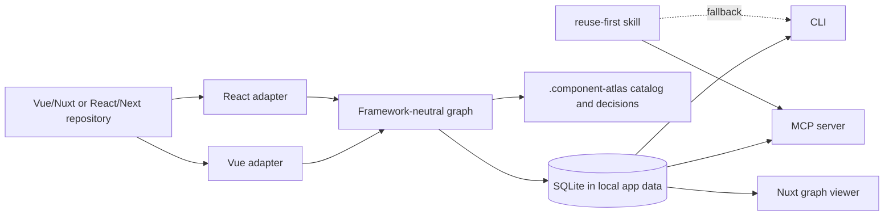

# Architecture

Component Atlas is local-first and deliberately split into analysis, storage,
agent access, and presentation.



## Package boundaries

- `core`: graph schema, search, explainable similarity, and impact traversal.
- `adapter-vue`: Vue SFC macros, templates, Nuxt runtime names, autoimports, and
  mirrored tests.
- `adapter-react`: exported and file-local React components, props, JSX
  composition, styling tokens, and tests.
- `store`: SQLite persistence using Node's built-in `node:sqlite`.
- `runtime`: detection, indexing orchestration, artifacts, and decision records.
- `cli`: human and script interface.
- `mcp`: agent-facing tools over stdio.
- `viewer`: read-only local Nuxt application. It reads the database through a
  minimal server boundary and does not bundle the analyzers.

## Graph model

A component node records:

- source and effective runtime names;
- public, feature, or private scope;
- props, emits, slots, and models;
- rendered component names and imports;
- tests, source location, class tokens, and a content hash.

The graph currently has three edge types:

- `renders`: source composition and impact traversal;
- `similar_to`: weighted structural evidence, never an automatic refactor;
- `tested_by`: component-to-test traceability.

Similarity weights are intentionally deterministic:

- name intent: 30%;
- shared props: 25%;
- rendered children: 20%;
- static class tokens: 15%;
- matching API shape: 10%.

Every similarity result includes the shared evidence so a developer or agent can
reject a superficially similar match.

## Storage

Large and machine-oriented state is written to:

```text
%LOCALAPPDATA%\ComponentAtlas\projects\<project-id>\atlas.sqlite
```

The analyzed repository receives only:

```text
.component-atlas/
├── project.json
├── catalog.md
└── decisions/
```

The CLI setup command adds `.component-atlas/` to the Git global excludes file.
This keeps the artifacts available to local agents without polluting project
commits.

## Scope semantics

- `public`: shared UI, layout, or common component.
- `feature`: exported component owned by one product feature.
- `private`: file-local React component or explicitly local Vue component.

A private component is a discovery candidate, but never a valid cross-feature
import. The reuse gate must choose `extract-and-reuse` when its responsibility
should become shared.
