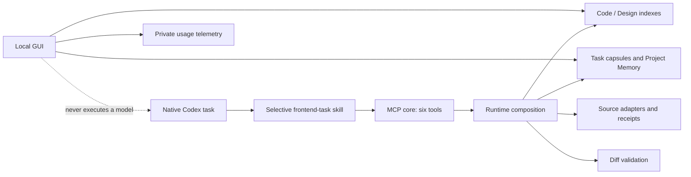

# Architecture

Project Atlas separates deterministic evidence from model execution.

## Packages

- `core`: shared types, task/source/risk and change-surface rules;
- `adapter-*`: framework scanners;
- `design`: design normalization, variables and snapshots;
- `memory`: memory formats and indexing;
- `store`: SQLite persistence, evaluations and usage traces;
- `runtime`: orchestration of deterministic scanners/adapters/receipts;
- `mcp`: core and temporary legacy tool exposure;
- `cli`: project, storage, telemetry and GUI commands;
- `apps/viewer`: local evidence/review UI and local API.

There is no agent package. MCP tools call runtime functions; prompts do not
reimplement scanner, store or adapter logic.

## Profiles

`core` is default and exposes six stable high-level operations. `legacy`
preserves 34 v1 tools only for parity and field rollout. Installation registers
core. The legacy profile is retired after the v2 acceptance gates in
[the audit](project-atlas-v2-audit.md#parity-and-retirement-gates).

The core source-state vocabulary is `pending`, `confirmed`, `omitted`,
`unavailable`, and `replaced`. Historical `external` is accepted only by the
legacy adapter/types for read and migration compatibility; callers must convert
it to `confirmed` plus an exact current receipt, or to `omitted`/`unavailable`,
before using the core workflow.

## Storage and identity

Atlas stores data outside checkouts under the centralized local storage root.
Logical-project identity and checkout identity are distinct; code graphs and
local decisions remain checkout-bound, while explicitly approved durable memory
can be logical-project scoped.

## Trust boundary

The GUI and Atlas CLI can perform explicit local product operations. Native
Codex alone owns model execution and filesystem sandbox choice. External
sources are fetched through declared routes with SSRF/size/content guards, and
their bodies are not persisted in task telemetry.
