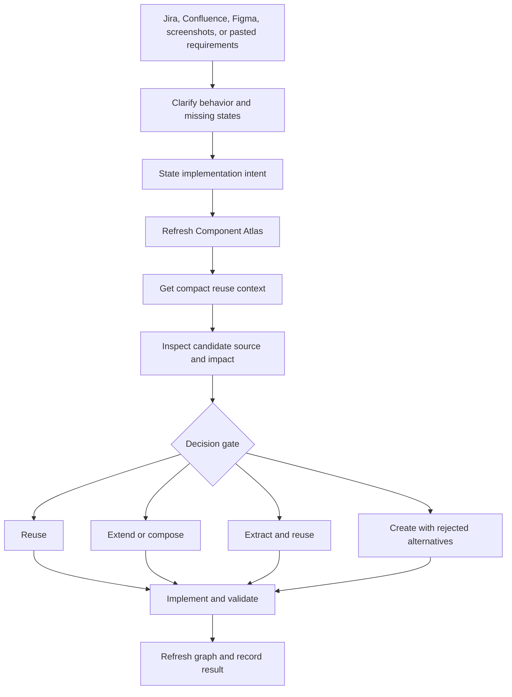

# Reuse-first workflow

Component Atlas sits between requirement discovery and implementation.



## Agent gate

Use `skills/reuse-first` whenever frontend work may create or substantially
change a component:

1. Clarify only requirements that can change the component decision.
2. Refresh the repository index.
3. Call `get_reuse_context` with one precise implementation intent.
4. Inspect the strongest candidate's source when the compact bundle is not
   sufficient.
5. Run dedicated impact analysis before changing a shared API.
6. Record exactly one `reuse`, `extend`, `compose`, `extract-and-reuse`, or
   `create` decision.
7. Implement, validate in the target repository, and refresh the graph.

## Useful commands

```powershell
component-atlas scan "C:\path\to\repo"
component-atlas context "C:\path\to\repo" "empty state with retry"
component-atlas show "C:\path\to\repo" UiEmptyState
component-atlas similar "C:\path\to\repo" MonthlySalaryDialog
component-atlas impact "C:\path\to\repo" UiModal
component-atlas open "C:\path\to\repo"
```

Record a decision:

```powershell
component-atlas decision "C:\path\to\repo" `
  --intent "confirmation dialog for deleting an account" `
  --decision extend `
  --select "react:src/components/ui/ConfirmActionDialog.tsx#ConfirmActionDialog" `
  --rationale "Existing semantics and focus handling match; add a danger variant."
```

## Current boundary

Jira, Confluence, Figma links, screenshots, and pasted text are task context
owned by the calling agent or future `frontend-task` skill. Atlas itself indexes
only local source code and never assumes a connector is installed.
