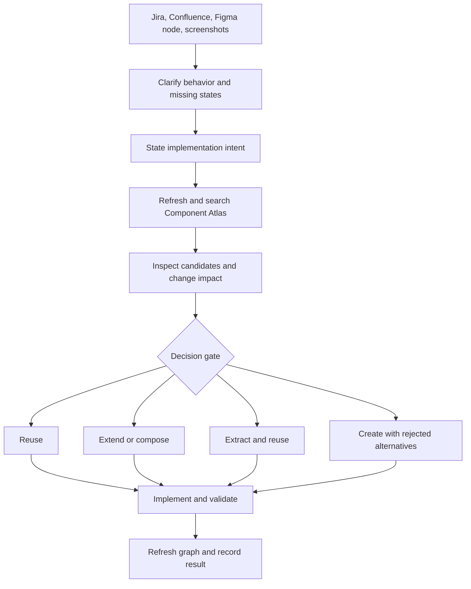

# Reuse-first workflow

Component Atlas sits between requirement discovery and implementation.



## Agent gate

Use the repository's `skills/reuse-first` skill whenever a task creates or
substantially changes frontend UI. It forces:

1. a compact requirements interrogation;
2. multiple intent-based component searches;
3. inspection of source API, similarity, usage, and change impact;
4. one explicit `reuse`, `extend`, `compose`, `extract-and-reuse`, or `create`
   decision;
5. a local Markdown decision record before implementation;
6. a post-change graph refresh.

This prevents “search by filename only,” which misses private components,
autoimports, components with domain-specific names, and near-duplicates.

## Useful commands

```powershell
component-atlas scan "C:\path\to\repo"
component-atlas search "C:\path\to\repo" "empty state with retry"
component-atlas show "C:\path\to\repo" UiEmptyState
component-atlas similar "C:\path\to\repo" MonthlySalaryDialog
component-atlas impact "C:\path\to\repo" UiModal
component-atlas open "C:\path\to\repo"
```

Record a decision:

```powershell
component-atlas decision "C:\path\to\repo" `
  --intent "confirmation dialog for deleting an account" `
  --decision extend `
  --select "react:src/components/ui/ConfirmActionDialog.tsx#ConfirmActionDialog" `
  --rationale "Existing semantics and focus handling match; add a danger variant."
```

## Current boundary

The first release accepts Jira, Confluence, Figma links, and screenshots as task
context supplied to the coding agent. It does not yet ingest those systems into
the Atlas database. That integration belongs after the component graph and reuse
gate have proved useful in daily work.
