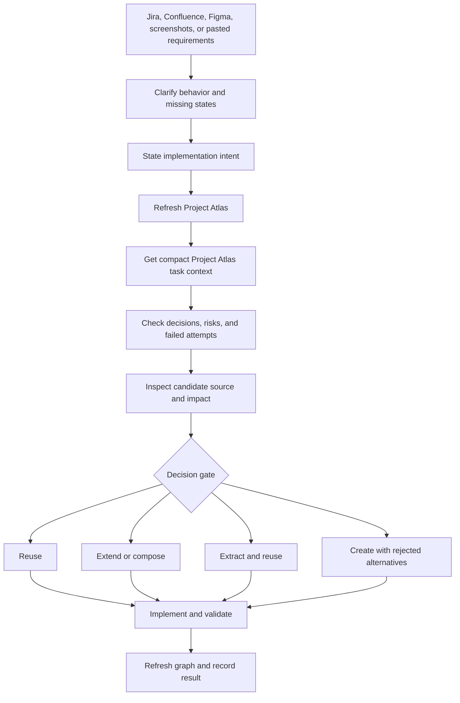

# Reuse-first workflow

Project Atlas sits between requirement discovery and implementation.



## Agent gate

Invoke `skills/frontend-task` to prepare the complete task. It detects the
available sources, creates the minimal brief, applies the uncertainty gate, and
then delegates the component decision to `skills/reuse-first`.

Use `skills/reuse-first` directly whenever already-prepared frontend work may
create or substantially change a component:

1. Clarify only requirements that can change the component decision.
2. Refresh the repository index.
3. Call `get_task_context` with one precise intent and a small shared budget.
4. Run `check_before_change` for the likely area/files.
5. Inspect the strongest candidate's source when the compact bundle is not
   sufficient.
6. Run dedicated impact analysis before changing a shared API.
7. Record exactly one `reuse`, `extend`, `compose`, `extract-and-reuse`, or
   `create` decision.
8. Implement, validate in the target repository, refresh the graph, record the
   outcome, and propose any genuinely durable Project Memory delta.

## Useful commands

```powershell
component-atlas scan "C:\path\to\repo"
component-atlas context "C:\path\to\repo" "empty state with retry"
component-atlas memory orient "C:\path\to\repo" --budget 2400
component-atlas memory task "C:\path\to\repo" "empty state with retry" --budget 3600
component-atlas memory check "C:\path\to\repo" "change empty state API"
component-atlas show "C:\path\to\repo" UiEmptyState
component-atlas similar "C:\path\to\repo" MonthlySalaryDialog
component-atlas impact "C:\path\to\repo" UiModal
component-atlas open "C:\path\to\repo"
```

These queries return compact agent context. Add `--raw` only when debugging an
incorrect index result, not while deciding whether to reuse a component.

Project Memory follows an orient → search → expand ladder. Do not search every
memory item on every turn; `frontend-task` decides whether retrieval adds value.

Optional Figma context:

```powershell
component-atlas figma map "C:\path\to\repo" "<figma-url>" `
  --metadata ".\figma-metadata.xml" `
  --format figma-mcp-xml `
  --scope-node "12:34" `
  --scope-page-id "1:2" `
  --scope-page-name "Checkout"
component-atlas figma find "C:\path\to\repo" "add coupon validation to checkout"
component-atlas figma inspect "C:\path\to\repo" "<figma-file>" "12:34"
```

Ready for dev is a boost when present, not a condition for these commands.
`source-unavailable` means the connector could not expose the field, not that
the node has no Figma state.
Semantic file/page/frame names, hierarchy, annotations, components, variants,
device context, and Atlas evidence remain active when every node has status
`none`.

For a large confirmed frame, use the inspection handoff to narrow sparse child
metadata to the smallest relevant subtree before deep context. If it cannot be
isolated, select the subtree manually rather than accepting target truncation.

Record a decision:

```powershell
component-atlas decision "C:\path\to\repo" `
  --intent "confirmation dialog for deleting an account" `
  --decision extend `
  --select "react:src/components/ui/ConfirmActionDialog.tsx#ConfirmActionDialog" `
  --rationale "Existing semantics and focus handling match; add a danger variant."
```

## Current boundary

Jira, Confluence, screenshots, and pasted text remain task context owned by
`frontend-task`. Atlas indexes local source code and can cache sparse Figma
metadata supplied by that agent; it never assumes a connector, credential,
Ready for dev status, Code Connect mapping, or Variables permission exists.
